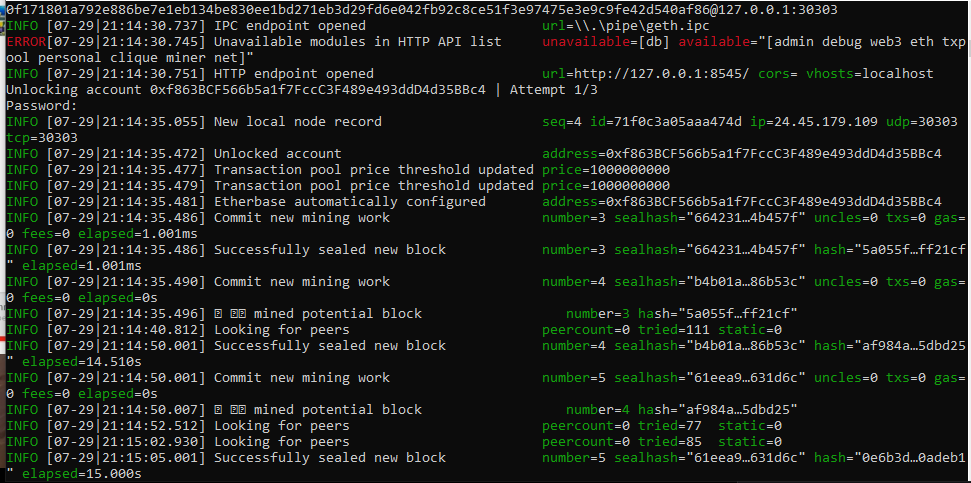
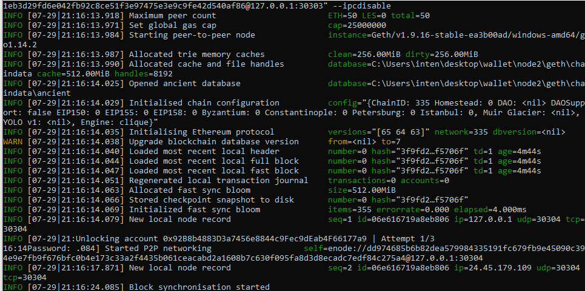
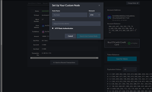
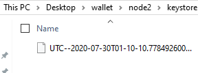
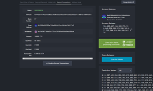
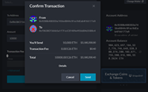

# Blockchain Homework

## Intialize nodes

1) Utilize the *./geth account new --datadir [nodename]* function
2) Save public & private addresses in notepad
3) Create/save passwords for each note
4) use *./geth init yournetworkname.json --datadir [nodename]*

## Begin the network processing
1) New command prompt, run  *./geth --datadir node1/ --rpc --networkid yournetworkid --unlock 'node1privatekey' --mine --allow-insecure-unlock --port 30303*

 
2) Store the "self enode" value in your notepad for future reference
3) New command prompt for node2 run  *./geth --networkid yournetworkid --datadir node2 --mine --unlock 'node2privatekey' --allow-insecure-unlock --port 30304 --bootnodes "enode from node1" --ipcdisable*

## Create network in Mycrypto
1) Create a new network select *change network*
2) Select *add custom node* 
3) use the same network name and chain ID 
4) URL should be the https://127.0.0.1:8545/
5) Once created, use the keystore file from the pre-funded node

6) send a transaction

